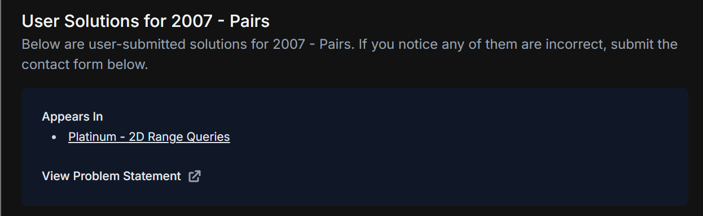
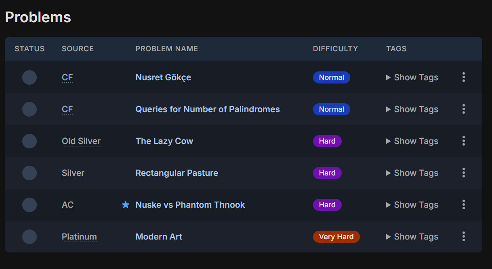

# Contribution [1]: Contact Form Submission - Suggestion (Problem Solution - 2007 - Pairs (ID: ioi-07-pairs))

**Contribution Number:** [1]  
**Student:** Angelie Bautista  
**Issue:** [\[GitHub issue link\] ](https://github.com/cpinitiative/usaco-guide/issues/5867)  
**Status:** [Phase I] [In Progress]

---

## Why I Chose This Issue

I chose issue 5867 "Contact Form Submission - Suggestion (Problem Solution - 2007 - Pairs (ID: ioi-07-pairs))", due to my familiarity with Javascript and Typescript. I believe I can learn MDX within a reasonable time and contributing to this project will widen my tech skills for websites. The issue is marked as a good first issue and the maintainer is active. Additionally, my job goals align with USACO's mission to support computing education for high schoolers through competitions and well-documented guides. I hope to understand how USACO organizes their learning material and communicates with each other in order to apply it to my future endeavors.

The issue is a suggestion to move 2007 - Pairs into the Prefix Sum section. In the issue thread, the maintainer agreed to the change. Ultimately, my contribution will improve topic organization for 2007 - Pairs.

---

## Understanding the Issue

### Problem Description

"Pairs" from the 2007 problem set could appear in a Silver module on Prefix Sums or a related Prefix Sum module with the user's solution. This change is classified as an enhancement for the site and is not a bug fix.

### Expected Behavior

The "Pairs" problem would appear in a problem list for "More on Prefix Sums", as it applies 2D prefix sums. Alternatively, it can appear in a Platinum section related to prefix sums.

### Current Behavior

"Pairs" is currently only directly referenced to a Platinum module on 2D Range Queries, as seen at the top of the user solution page (https://usaco.guide/problems/ioi-07-pairs/user-solutions).

### Affected Components

Relevant components fo are located inside the /content directory. The most relevant module .mdx file would be 3_Silver/More_Prefix_Sums.mdx.

---

## Reproduction Process

### Environment Setup

USACO Guide supports an online live editor, but I chose to test the site locally using Yarn as written in the Contribution Guide. Had it running in 20 minutes and my only issue was admin access for corepack enable, which is a required tool for managing package managers like Yarn.

Working branch: https://github.com/AB-tachyonwinds/usaco-guide

### Steps to Reproduce
View the most relevant existing module for Prefix Sums:
1. Navigate to http://localhost:3000/silver/more-prefix-sums
2. Scroll down to Problems section after Solution for Forest Queries 
3. Pairs could potentially be added to that table as a Hard (or Very Hard) question

### Reproduction Evidence

- **Screenshots/logs:** 
Current text signifying modules referencing the Pairs problem. We want Prefix Sum to appear here.

Current problem list of More Prefix Sums in Silver
- **My findings:** A module is largely made up of its mdx file and a corresponding json file specifically for the problem list.

---

## Solution Approach

### Analysis

[Your analysis of the root cause - what's causing the issue?]

### Proposed Solution

[High-level description of your fix approach]

### Implementation Plan

Using UMPIRE framework (adapted):

**Understand:** [Restate the problem]

**Match:** [What similar patterns/solutions exist in the codebase?]

**Plan:** [Step-by-step implementation plan]
1. [Modify file X to do Y]
2. [Add function Z]
3. [Update tests]

**Implement:** [Link to your branch/commits as you work]

**Review:** [Self-review checklist - does it follow the project's contribution guidelines?]

**Evaluate:** [How will you verify it works?]

---

## Testing Strategy

### Unit Tests

- [ ] Test case 1: [Description]
- [ ] Test case 2: [Description]
- [ ] Test case 3: [Description]

### Integration Tests

- [ ] Integration scenario 1
- [ ] Integration scenario 2

### Manual Testing

[What you tested manually and results]

---

## Implementation Notes

### Week [X] Progress

[What you built this week, challenges faced, decisions made]

### Week [Y] Progress

[Continue documenting as you work]

### Code Changes

- **Files modified:** [List]
- **Key commits:** [Links to important commits]
- **Approach decisions:** [Why you chose certain approaches]

---

## Pull Request

**PR Link:** [GitHub PR URL when submitted]

**PR Description:** [Draft or final PR description - much of the content above can be adapted]

**Maintainer Feedback:**
- [Date]: [Summary of feedback received]
- [Date]: [How you addressed it]

**Status:** [Awaiting review / Iterating / Approved / Merged]

---

## Learnings & Reflections

### Technical Skills Gained

[What you learned technically]

### Challenges Overcome

[What was hard and how you solved it]

### What I'd Do Differently Next Time

[Reflection on your process]

---

## Resources Used

- [Link to helpful documentation]
- [Tutorial or Stack Overflow post that helped]
- [GitHub issues or discussions that helped]
